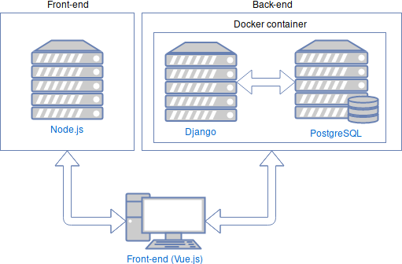

# Architecure

In this part of the trckr documentation, the software architecture is explained.

## Architecture Sketch

Trckr is a web based application. The web frontend is developed with Javascriüt and has access to a PostgreSQL database via the backend, which is written in Python. 

## Technlogies & Tools

### Backend

* Python ([Django](https://www.djangoproject.com/))
* [PostgreSQL](https://www.postgresql.org/)

### Frontend

* JavaScript ([Vue.js](https://vuejs.org/))
