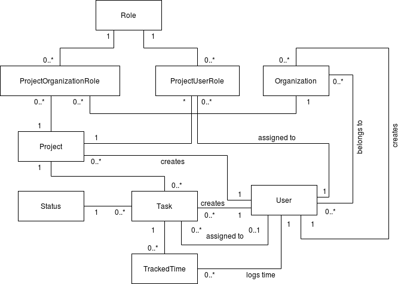

# Domain Model

The domain model gives a rough overview over the different interactions between our different domain objects. 

A user is able to create projects, tasks and organizations. Access rights for projects are defined through Roles, which can either be assigned directly to a user or to a whole organization. A task can only have a single assignee at a time, but multiple users can track their time for the same task.
